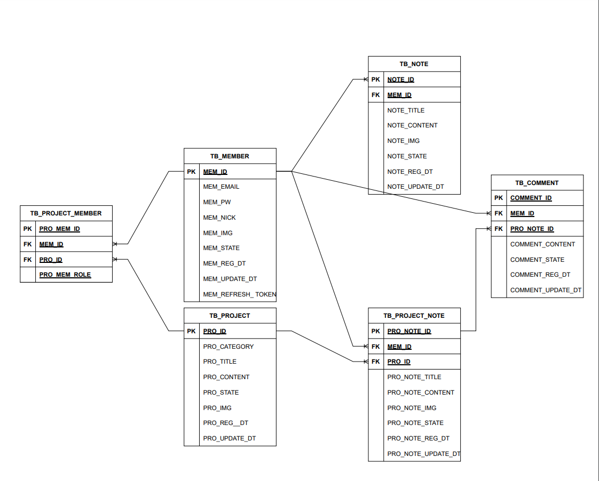

# WeNote

## 소개

To-Do List를 간단히 구성한 1인 토이 프로젝트입니다.

개인 노트를 구성할 수 있으며,

프로젝트를 만들어 여러 사람과 같은 목표의 To-Do List를 구성할 수 있습니다.

프론트는 Vercel , 백엔드는 CloudType을 통하여 배포했습니다.

 

### URL

- 배포 URL : https://port-0-wenote-back-4uvg2mleqmc0d8.vercel.app/

- 백엔드 Github URL : https://github.com/Guksu/WeNote_back

---

 

## 프로젝트 구성

1. 프론트

- Next.js / SCSS / TypeScript / Zustand

 

2. 백엔드

- Node.js / Express / TypeScript / MySQL

 

3. API 설계서 URL

- https://docs.google.com/spreadsheets/d/16BUAl2U6MTI-3MYBYlHr_-RtprzMEI-ATMWvHgpy6Oc/edit?usp=sharing

4. ERD 이미지

### 참조 사이트

- 일일일 : https://oneoneone.kr/
